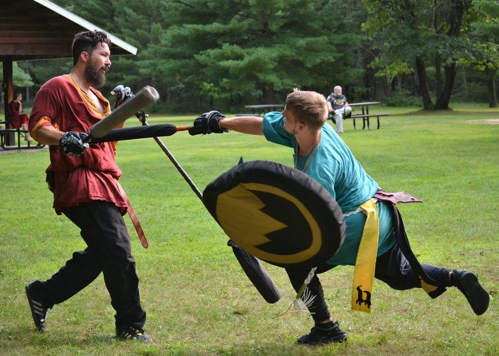
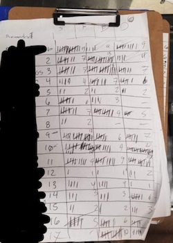
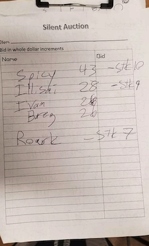

# Amtgard Tournament Creator

04 Oct, 2021 | Proth Cohort

## Application Overview

This application is intended to fill a technology gap for the international non-profit “Amtgard” when tracking live tournament attendance, scores and entrant information. Its purpose is to provide an easy-to-use mobile application to create tournament formats and store results that can be easily referenced at any time by non-profit members.

## What is Amtgard?

Amtgard is an international-non-profit that is also a medival / fantasy L.A.R.P. (Live Action Role Play) Imagine a reneissance festival. A prominant portion of amtgard centers around their games which can include games like `capture-the-flag`, or `ring the bell` all while simulating `medieval combat` with padded, safe and no-where close to real "weapons". Because of the nature of these games the sport frequently hosts tournaments where members face off against each other in 1 vs 1 medieval combat. Winning these tournaments is highly revered by members and many chase the recognition that comes with placing in them.

## How is tournament information currently tracked?

By pen and paper. Tournaments are held in parks or camp grounds far from most outlets and sometimes even a stable internet connection. Once the tournament is complete a short announcement is made by word of mouth stating the highest placements. The details of the tournament ( entrants, scores, placements ) are then typed by hand into a laptop or facebook post a few days later by the tournament organizer once they return home from said event.

An example of official paperwork for live score keeping (`left`) and results (`right`).

 

## Pages

### Registration / Login

### Profile

### My Tournaments

### 
