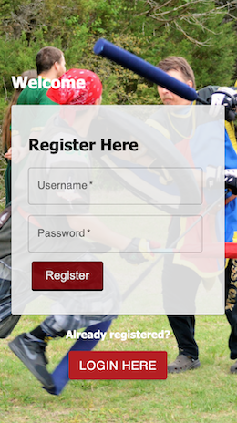
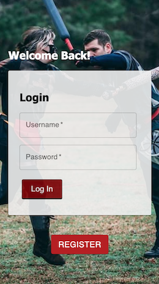
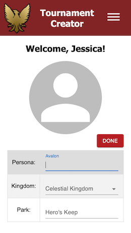
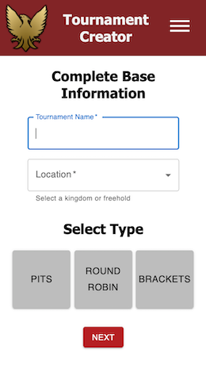
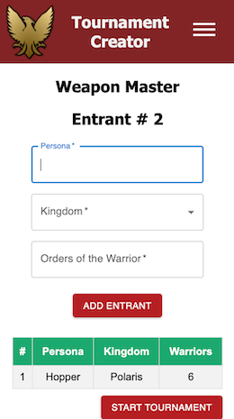

# Amtgard Tournament Creator

04 Oct, 2021 | Proth Cohort

## Application Overview

This application is intended to fill a technology gap for the international non-profit “Amtgard” when tracking live tournament attendance, scores and entrant information. Its purpose is to provide an easy-to-use mobile application to create tournament formats and store results that can be easily referenced at any time by non-profit members.

## What is Amtgard?

https://www.amtgard.com/

Amtgard is an international-non-profit that is also a medival / fantasy L.A.R.P. (Live Action Role Play) Imagine a reneissance festival. A prominant portion of amtgard centers around their games ( ex. `capture-the-flag` ), all while simulating `medieval combat` with padded, safe and no-where close to real "weapons". Because of the nature of these games the sport frequently hosts tournaments where members face off against each other in 1 vs 1 medieval combat. Winning these tournaments is highly revered within the community and many chase the recognition that comes with placing in them.

## How is tournament information currently tracked?

By pen and paper. Tournaments are held in parks or camp grounds far from most outlets and sometimes even a stable internet connection. Once the tournament is complete a short announcement is made by word of mouth stating the highest placements. The details of the tournament ( entrants, scores, placements ) are then typed by hand into a facebook post usually within about a week after the event.

An example of official paperwork for live score keeping (`left`) and results (`right`).

 

## Pages

### Registration / Login

Registration currently only requires a username and password. However some other information can be added through the user profile. Once the user either creates a profile or logs in, they are redirected to their profile page.

    

### Profile / Edit Profile

The user's profile can be edited by clicking the edit button. The inputs can then be filled in and one you click the `done` button the user is redirected to their profile page with the updated information.

   

### Navigation

The user can navigate throughout the app by clicking on the drawer icon in the upper right hand corner to open the menu. Clicking on any of the options inside of the menu will close the drawer and navigate to that page, otherwise the user can click outside of the drawer to return to the current page.

### My Tournaments / Tournament Details

This page is reached by clicking `My Tournaments` in the nav drawer.
Tournaments listed on this page are the ones created by the logged in user. Each card can be clicked on to bring you to that tournament's detail page (`right`).

  

## Create Tournament

### Create Base Information

This page is reached by clicking `Create Tournaments` in the nav drawer.
Base information and 1 of 3 type ( ex. `pits` ) are selected. This information will be used as search criteria in the search page. Clicking on the `next` button will bring you to the `Create Entrants` page.

Future additions: `Categories`

 

### Create Entrants

Entrants made here are assigned to the tournament created on the previous page. As the entrant is entered with the `Add Entrant` button they are assigned a number ( `left hand column of table` ) that can be used for tracking individuals in a live setting, even if they have the same name. Once all entrants are added, clicking the `start tournament` button will navigate to the live score keeping page.

### Create Scores

Scores are tracked for each individual entrant. The image below is the score tracking for the `Pits` style tournament. Clicking the `Show Placements!` button will navigate to that tournament's detail page.

Future additions: `Round Robin` and `Brackets`

## More to come!
